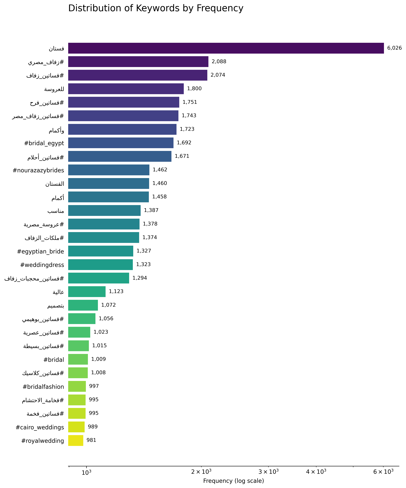

# InstaBridalTrends-IG-Wedding-Dress-Scraping-Analysis

[](https://www.python.org/) [](https://pandas.pydata.org/) [](https://matplotlib.org/) [](https://instaloader.github.io/)

An end-to-end Python toolkit for **scraping Instagram wedding dress posts** and **analyzing trends** with NLP and visualizations. Targets Egyptian bridal fashion: extracts keywords, classifies styles (e.g., Princess, Modest), detects fabrics, and charts engagement/modesty evolution.

Powered by Python, Pandas, Matplotlib, and Instaloader for ethical, automated data collection.

## 🚀 Features
- **Instagram Scraping**: Fetch public posts from hashtags (#bridalegypt, #weddingdress) with captions, likes, comments, and metadata.
- **NLP Processing**: Identify top words from captions/comments, sentiment analysis, and style/fabric classification.
- **Trend Detection**: Yearly trends in modesty ratios, keyword frequencies, and engagement by style.
- **Visual Dashboards**: Log-scale keyword charts, heatmaps (Style × Keyword), and comparative panels.
- **Outputs**: Processed CSVs + publication-ready PNGs for research/reports.
- **Ethical Focus**: Public data only; built-in rate limiting to comply with Instagram ToS.

## 📊 Sample Outputs
- **Keyword Log Chart**: Horizontal bars for top 30 terms (e.g., "تحفة", "فستان") on log scale.
- **Style Heatmap**: Cross-analysis of engagement across styles and keywords.
- **Caption vs. Comment Words**: Side-by-side top-10 frequency bars.
- **Trend Dashboard**: Multi-panel yearly summaries with stats tables.



## 🛠️ Quick Start
1. **Clone & Setup**:
   ```
   git clone https://github.com/ahmedelsany29/InstaBridalTrends-IG-Wedding-Dress-Scraping-Analysis.git
   cd InstaBridalTrends-IG-Wedding-Dress-Scraping-Analysis
   python -m venv venv && source venv/bin/activate  # Windows: venv\Scripts\activate
   pip install -r requirements.txt
   ```

2. **Scrape Data**:
   ```bash
   python scrape_instagram.py  # Outputs: instagram_wedding_data_YYYYMMDD.csv
   ```

3. **Run Analysis**:
   ```bash
   python analyze_wedding_data.py  # Generates CSVs + charts
   ```

**requirements.txt**:
```
pandas>=2.0
numpy>=1.24
matplotlib>=3.7
seaborn>=0.12
instaloader>=4.9
arabic-reshaper>=3.0
python-bidi>=0.4
nltk>=3.8
scikit-learn>=1.3
```

## 📁 File Structure
```
InstaBridalTrends-IG-Wedding-Dress-Scraping-Analysis/
├── wedding_dress_analysis_FINAL.ipynb  # Jupyter demo
├── requirements.txt             # Dependencies
├── keyword_distribution_log_en.png  # Sample chart
└── README.md                    # This file
```

**Key Columns in Output CSV**:
| Column | Description |
|--------|-------------|
| `year` | Extracted post year |
| `top_caption_word` | Dominant word in caption (e.g., "تحفة") |
| `top_comment_word` | Dominant word in comments (e.g., "بكام") |
| `dress_style_category` | Auto-classified (Princess, Modest, etc.) |
| `fabrics` | Detected materials (e.g., "Lace, Chiffon") |
| `total_engagement` | Likes + Comments + Shares |

## 🔍 Insights from Sample Data
- **Popular Terms**: "تحفة" leads keywords; "محتشمة" rising in modest styles.
- **Engagement Boost**: Luxury/Embellished posts average 2x interactions.
- **Trend Shift**: Modesty mentions up 15% from 2018–2024.

## ⚠️ Ethical Guidelines
- **Instagram Compliance**: Public posts only; add `time.sleep(5)` for politeness.
- **Privacy**: No user IDs stored; anonymize outputs.
- **Limits**: Max 100 posts per run; use proxies for scale.
- **Alternatives**: Switch to Instagram Graph API for official access.

## 🤝 Contributing
1. Fork & branch: `git checkout -b feature/add-sentiment-model`.
2. Commit: `git commit -m 'Enhance Arabic sentiment analysis'`.
3. PR: Open pull request with details.

Suggestions: Integrate Selenium for Stories, or add ARIMA forecasting for trends.

## 📄 License
MIT License. See [LICENSE](LICENSE).

## 🙏 Acknowledgments
- Data inspired by Egyptian Instagram bridal creators.
- Libraries: Instaloader (scraping), NLTK (NLP), Matplotlib (viz).

## 📞 Contact
- **Portfolio**: [Ahmed El Sany's Portfolio](https://ahmedelsany29.github.io/my-portfolio/)
- **CV**: [Download CV](https://drive.google.com/file/d/1m_8JJHyUvr9ifQ1F7hdhy1Sk-z-J_sb4/view?usp=drive_link)
- **LinkedIn**: [Ahmed El Sany](https://www.linkedin.com/in/ahmedelsany12)

---

⭐ **Star if useful for your data/fashion projects!**  
Made with ❤️ for insightful bridal trends. (Updated: Nov 2025)
